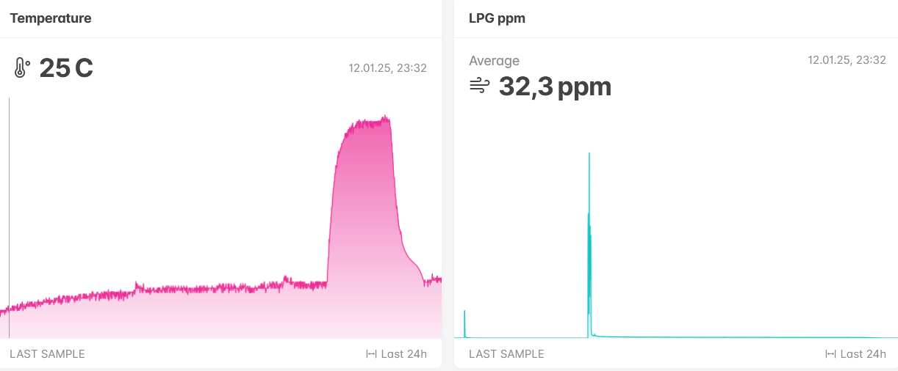
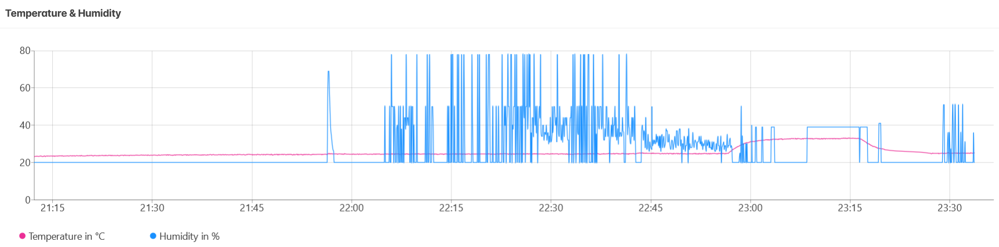
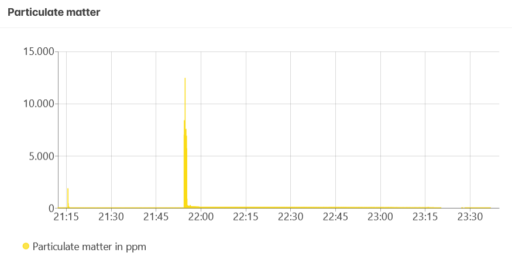

# airsafemonitor

This is a raspberry pi-based air quality monitoring system that measures the temperature, humidity, and LPG gas levels using the DHT11 and MQ2 sensor, and LED indicators. The data is processed and sent to an API or MQTT broker for real-time monitoring.

## features

- measures temperature and humidity using the DHT11 sensor
- measures LPG gas levels using the MQ2 sensor
- LED indicators for the status of the sensors
    - green: safe
    - yellow: warning
    - red: dangerous (blinks for very high levels)
- sends data to an API for real-time monitoring

## components

- raspberry pi 4
- DHT11 temperature and humidity sensor
- MQ2 gas sensor
- LED module (green, yellow, red)
- MCP3008 ADC (10 bit analog to digital converter)
- breadboard
- jumper wires
- resistors:
    - 1k ohm and 560 ohm for voltage divider (converting 5V MQ2 output to 3.3V)
- power supply for the raspberry pi
- (optional) LAN cable for SSH access/debugging

## wiring

### DHT11 sensor

- VCC: 5V
- GND: GND
- DATA: GPIO 5

### MQ2 sensor

- VCC: 5V
- GND: GND
- AOUT: MCP3008 CH0

### LED module

- green: GPIO 17
- yellow: GPIO 27
- red: GPIO 22
- GND: GND

### MCP3008 ADC

The MCP3008 ADC communicates with the raspberry pi via SPI, but since it operates at 5V due to the MQ2 sensor and the raspberry pi operates at 3.3V, we need a voltage divider on the DOUT (MISO) line (this reduces the 5V signal to ~3.2V).

- DGND: GND
- CS: GPIO 8 (CE0)
- DIN: GPIO 10 (MOSI)
- DOUT: connected to a voltage divider to GPIO 9 (MISO)
- CLK: GPIO 11 (SCLK)
- AGND: GND
- VREF: 3.3V
- VDD: 3.3V

### voltage divider

- attach one leg of a 560 ohm resistor to the DOUT pin of the MCP3008
- connect the second leg of the 560 ohm resistor to a row on the breadboard
- use a jumper wire to connect this row the GPIO 9 (MISO) pin of the raspberry pi
- in the same row, connect a 1k ohm resistor to GND

```
MCP3008 DOUT --- [560 Ω] ---+--- GPIO 9 (MISO)
                            |
                         [1 kΩ]
                            |
                           GND
```

## setup

### python & dependencies

You need to have python3 installed on your system.

```sh
sudo apt update
sudo apt install python3 python3-pip
```

Set up a python virtual environment and install the required libraries.

```sh
python3 -m venv venv
source venv/bin/activate
pip3 install -r requirements.txt
```

Note: using the circuitpython version as it is actively maintained and integrates better with modern raspberry pi's.

### .env file

Create a `.env` file in the root directory with the following content:

```sh
API_URL=
MQTT_TOPIC=
MQTT_BROKER=
MQTT_USERNAME=
MQTT_PASSWORD=
```

Note that `akenza.io` has been used for this project, but you can use any other API or MQTT broker, or leave the fields empty if you only want to monitor the data locally.

### SPI & Serial Port

Enable SPI & Serial Port on the raspberry pi. `Interface options - SPI - enable` and `Interface options - Serial Port - disable login shell over serial`.

```sh
sudo raspi-config
```

### clone the repository

```sh
git clone git@github.com:MaxiEurope/airsafemonitor.git
cd airsafemonitor
```

## usage

start the main script

```sh
python main.py
```

### calibration

The MQ2 sensor needs to be calibrated in clean air, this will take 25 seconds (default), ensure the sensor is in a clean-air environment during this time.

### LED indicators

- green: safe (LPG < 50 ppm)
- yellow: warning (50 ppm <= LPG < 100 ppm)
- red: dangerous (100 <= LPG < 200 ppm)
- red (blinking): very dangerous (LPG >= 200 ppm)

## testing

Each component can be testing using the scripts in the `/tests` directory.

```sh
python tests/dht11.py
python tests/mq2.py
python tests/led.py
```

## notes

- ensure the voltage divider circuit is correctly set up to avoid damaging the raspberry pi GPIO pins
- the DHT11 sensor has a 2 second minimal interval for reading data
- you can leave out the API or MQTT part if you only want to monitor the data locally

## images






